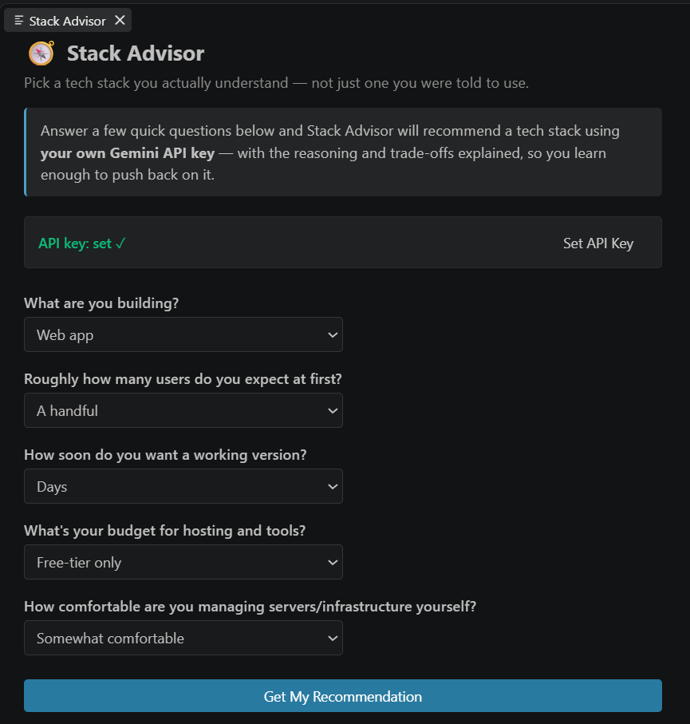

# Stack Advisor

Stack Advisor is a VS Code extension that helps "vibe coders" — people who build software by describing what they want to an AI — pick a tech stack they actually understand, instead of just going with whatever an AI hands them.

You answer five quick questions about what you're building, and Stack Advisor sends them (along with a lightweight summary of your currently open workspace, if any) to the Gemini API using your own API key. It comes back with a recommended stack — frontend, backend/language, database, and hosting — with the reasoning and trade-offs spelled out for each choice, so you can push back on it instead of just accepting it.

## Features

- **Guided questionnaire** — a simple panel asks what you're building, expected user count, timeline, budget, and your comfort level with managing infrastructure.
- **Workspace-aware recommendations** — if you have a project open, Stack Advisor reads `package.json` dependencies, common file types, top-level folder names, and your README to tailor its answer to what you've already got, rather than suggesting something redundant.
- **Reasoned output, not just an answer** — every recommendation explains *why* it fits your specific answers and names at least one realistic alternative or trade-off, so you learn something.
- **Honest about tension** — if your answers conflict (e.g. a tiny budget but thousands of expected users) or are too vague, it says so instead of forcing a clean answer.
- **Bring your own API key** — your Gemini API key is stored using VS Code's encrypted `SecretStorage`, never sent anywhere except directly to Google's API.

## Screenshot



## Requirements

- A [Gemini API key](https://aistudio.google.com/app/apikey) (free tier works). Nothing else to install — the extension has no other runtime dependencies.

## Getting Started

1. Install the extension.
2. Run **Stack Advisor: Set API Key** from the Command Palette and paste in your Gemini API key.
3. Run **Stack Advisor: Open Panel** to launch the questionnaire.
4. Answer the questions and click **Get My Recommendation**.

## Commands

| Command | Description |
| --- | --- |
| `Stack Advisor: Open Panel` | Opens the questionnaire panel and shows your recommendation. |
| `Stack Advisor: Set API Key` | Prompts for and securely stores your Gemini API key. |
| `Stack Advisor: Check API Key` | Shows whether a key is currently stored (without revealing it). |

## Privacy

Only your answers to the questionnaire and a small, non-sensitive summary of your workspace (dependency names, file extension counts, top-level file/folder names, and a short README excerpt) are sent to the Gemini API. Source code is never read or transmitted.

## Development

```bash
npm install
npm run compile   # or: npm run watch
```

Press `F5` in VS Code to launch an Extension Development Host and try it out. Run `npm run lint` and `npm test` before submitting changes.

## License

MIT
